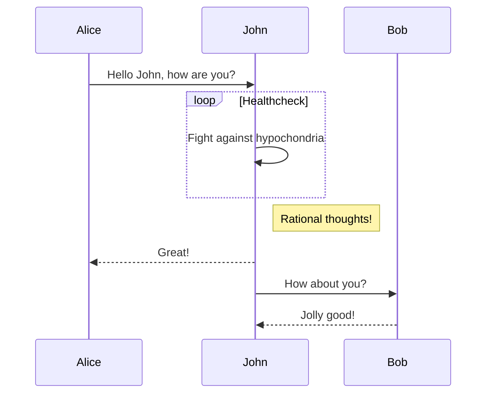
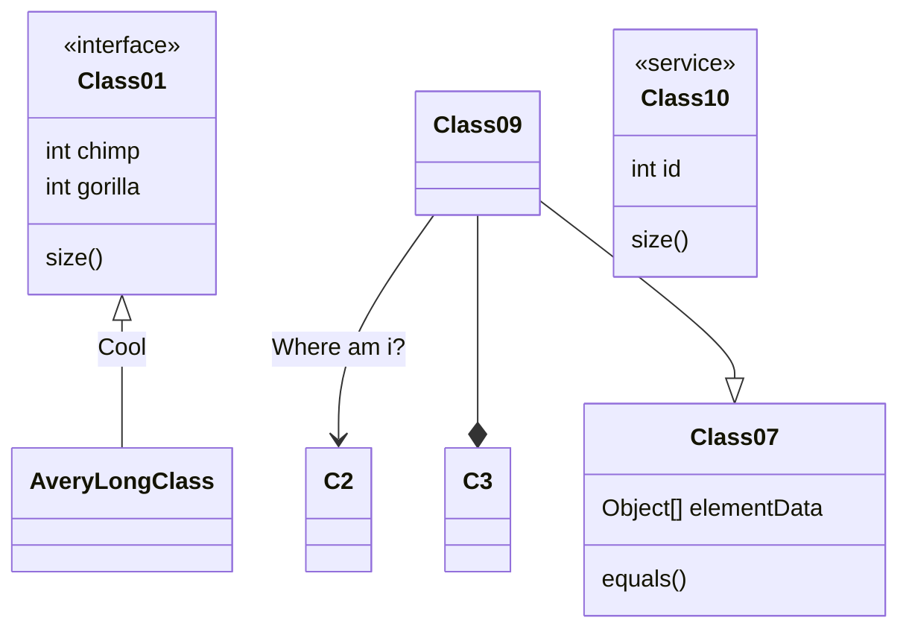

# 一级标题
## 二级标题
### 三级标题
#### 四级标题
##### 五级标题

正文

```java
System.out.println("Hello, World!");
```

```python
print("Hello, World!")
```

正文中的代码`System.out.println("Hello, World!");`

1. 列表1
   * 嵌套列表1
   + 嵌套列表2
   - 嵌套列表3

**加粗**  
*倾斜*  
~~删除线~~  
<u>下划线</u>  

使用 Markdown[^1]可以效率的书写文档, 直接转换成 HTML[^2], 你可以使用 Typora[^T] 编辑器进行书写。
[^1]:Markdown是一种纯文本标记语言
[^2]:HyperText Markup Language 超文本标记语言
[^T]:NEW WAY TO READ & WRITE MARKDOWN.

> 区块
> > 嵌套区块

| 左对齐 | 右对齐 | 居中对齐 |
| :-----| ----: | :----: |
| 单元格 | 单元格 | 单元格 |
| 单元格 | 单元格 | 单元格 |





